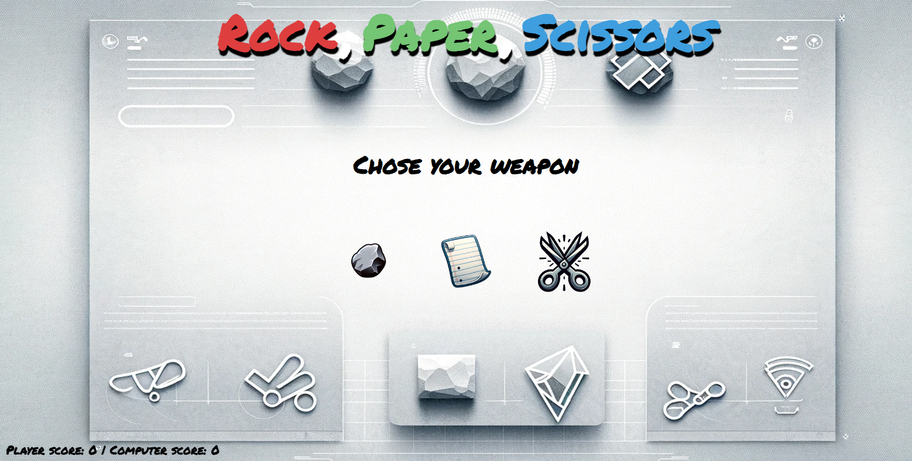

# The Odin Project - Rock, Paper, Scissors

This is a Rock, Paper, Scissors game written in javascript, html and css for the odin project.

[Live Link](https://antonharbers.github.io/Rock-Paper-Scissors/)



## Folder Structure

```
    /.git           -> The git repository
    /images         -> Contains the Icons and Favicon
    /sounds         -> Contains the Audio Files
    index.html      -> All the HTML
    README.md       -> Git Repository README file
    script.js       -> Contains all the logic
    style.css       -> Contains all the styling for large and small screens
```

## Key Concepts

### Event Listeners

The biggest key concept I take away from this project are Eventlisteners and their implementation. They allow you to hook certain function calls to certain DOM events that are fired during user interaction with the UI. Here's a basic overview:

#### Step 1

Add an HTML element to the dom either directly through the HTML document or using Javascript:

HTML:

```
      <button class="playAgainBtn">Play Again</button>
```

JS:

```
    let playAgainBtnElement = document.createElement('button');
    playAgainBtnElement.classList.add('playAgainBtn')
    // append the element to the needed DOM location here
```

#### Step 2

Select this element in your JS code. Important to not is that the element needs to be selectable with a query selector in the Javascript code:

JS:

```
const playAgainBtn = document.querySelector('.playAgainBtn');

```

#### Step 3

Assign the needed event listener with the following syntax:

JS:

```
    playAgainBtn.addEventListener('click', () => {
        restartGame();
    })
```

Here the addEventListener method is bound to our playAgainBtn Element. The First parameter we give the method is "click" (this can be subsituted for the type of listener applicable in your use case) and the second parameter is a callback function which calls our restartGame() function. This callback function can contian whatever implementation is needed once the desired event is fired by the user.

### Updating DOM elements

Another key concept this project shows us is how easy it is to use Javascript to manipulate DOM elements and their content.

An example of this can be seen in our "updateScoreUI" function:

JS:

```
    const updateScoreUi = () => {
    scoreDiv.textContent = `Player score: ${playerScore} | Computer score: ${computerScore}`; // THIS LINE RIGHT HERE
    computerScore >= 5 && gameOver('Computer wins! Better luck next time...');
    playerScore >= 5 && gameOver('Congratulations, you Win!');
    };
```

We are able to add new text to our scoreDiv by simply setting the textContent equal to whatever the new text should be whenever the updateScoreUI function is called.

### Gameplay Loops

Even in a basic game like rock, paper, scissors it is important to have a well designed game loop. For this game all that really needs to be figured out is how to keep score and how to implement the turns. My solution was to have a scoreCounter variable which would be incremented based on the result of any given round:

JS:

```
// The counter variables need to be initialized:
    var playerScore = 0;
    var computerScore = 0;

```

For the game loop itself I have an event listener on all the players weapon options which when fired will get a random choice from the computer player, compare the options and then return a result of one round. After every round there is another function checking weather the game is over and handling the UI updated and resetting of state accordingly:

JS:

```
// Here are the event listener:

    rockBtn.addEventListener('click', () => {
    selectPlayerOption('rock');
    rockAudio.play();
    });

    paperBtn.addEventListener('click', () => {
    selectPlayerOption('paper');
    paperAudio.play();
    });

    scissorsBtn.addEventListener('click', () => {
    selectPlayerOption('scissors');
    scissorsAudio.play();
    });

// Function being called:

    const selectPlayerOption = (selection) => {
    if (playerScore >= 5 || computerScore >= 5) return;
    resultDiv.textContent = playSingleRound(selection, getComputerChoice());
    };

// playSingleRound function updating the state:

    const playSingleRound = (playerSelection, compuerSelection) => {
    // Check for Draw
    if (playerSelection.toLowerCase() === compuerSelection.toLowerCase()) {
        return "It's a draw!";
    }
    // Evaluate Results
    switch (playerSelection.toLowerCase()) {
        case 'rock':
        compuerSelection === 'paper' ? computerScore++ : playerScore++;
        updateScoreUi();
        return compuerSelection === 'paper'
            ? 'You lose! Paper beats Rock'
            : 'You win! Rock beats Scissors';
        case 'paper':
        compuerSelection === 'scissors' ? computerScore++ : playerScore++;
        updateScoreUi();
        return compuerSelection === 'scissors'
            ? 'You lose! Scissors beats Paper'
            : 'You win! Paper beats Rock';
        case 'scissors':
        compuerSelection === 'rock' ? computerScore++ : playerScore++;
        updateScoreUi();
        return compuerSelection === 'rock'
            ? 'You lose! Rock beats Scissors'
            : 'You win! Scissors beats Paper';
        default:
        return 'Something went wrong!';
    }
    };

```

Important to note here is that the internal state of our game is not maintained once the browser window is refreshed or closed. To improve this functionality one could add some local storage to keep track of the current game state.

### Playing Audio

A challange I set myself for this project was to include some basic audio whenever the user made a selection. To implement this I added <audio> elements to the HTML, selected these in Javascript and then used the play() methods whenever the user would select one of the weapon options for a round:

HTML:

```
    <audio id="rockAudio" preload="auto">
      <source src="./sounds/rock.wav" type="audio/wav" />
    </audio>
```

JS:

```
// Selecting the correct element:
    const rockAudio = document.querySelector('#rockAudio');

// The audio is played on click:
    rockBtn.addEventListener('click', () => {
    selectPlayerOption('rock');
    rockAudio.play(); // RIGHT HERE
    });

```

### Transform for Animations and the CSS Background-Image

Instead of adding the Images directly to the HTML using the  tags I opted for the background-image CSS property instead as this would allow me to easily alter certain aspects of these images and their positions through CSS in an easier manner.

To add an image to the background of an element through CSS, just add the path to the background-image property and tweak the other background properties as needed:

CSS:

```
    #rockBtn,
    #paperBtn,
    #scissorsBtn {
    background-size: 100% 100%;         // Size can be tweaked
    background-repeat: no-repeat;       // Can be set to repeat or not
    background-position: center;        // Can be moved around
    }

    #rockBtn {
    background-image: url('./images/rock.png');
    }

    #paperBtn {
    background-image: url('./images/paper.png');
    }

    #scissorsBtn {
    background-image: url('./images/scissors.png');
    }
```

Once I was satisfied with the Images I wanted to implement some basic hover animations. I did this as shown below:

CSS:

```
    #rockBtn:hover,
    #paperBtn:hover,
    #scissorsBtn:hover {
    transform: scale(1.2) rotate(2deg);
    }

    #rockBtn:active,
    #paperBtn:active,
    #scissorsBtn:active {
    transform: scale(0.8) rotate(-4deg);
    }
```

On hover I rotate and scale the elements up and on active I rotate them around the scale them down. This adds some nice feedback for user interactions.

## Final Notes

This project helped cement the above mentioned concepts in my mind and showed me the importance of planning ahead. Even for such a simple game It's important to consider how the different elements all come together and how to be as clean as possible with your code early on so it does not get out of hand too quickly. Can recommend this project as a starting point to web development as the basic implentation teaches you enough, but it can be extended to help cement even more complex concepts in the future.
